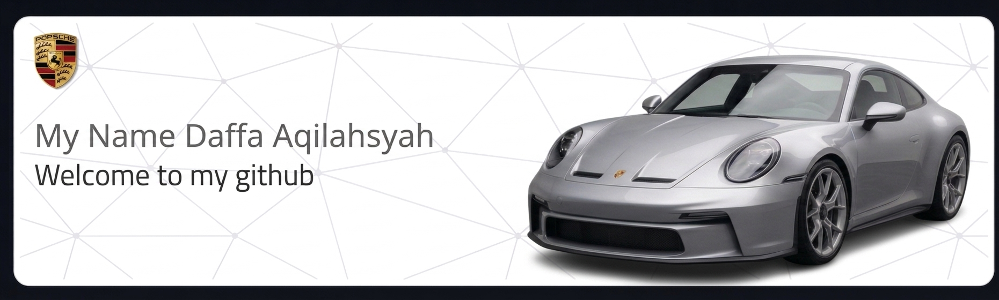

# 💫 About Me:
Saya adalah seorang mahasiswa Sistem Informasi yang berfokus pada pengembangan aplikasi mobile dan desain antarmuka pengguna. Saya memiliki ketertarikan pada estetika visual modern dan sering mengintegrasikan musik ke dalam alur kerja saya untuk meningkatkan konsentrasi.

  

  

## 🌐 Socials:
      

# 💻 Tech Stack:
       

# 📊 GitHub Stats:

---

### 🐍 Snake Animation Activity:

  

